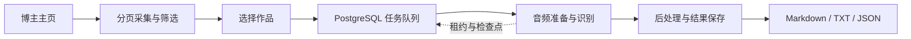

<div align="center">


# EchoLens

**把视频变成可筛选、可追溯、可复用的文字语料。**

从一条视频到一位博主：采集、筛选、转录，再把文字交给你的笔记或 LLM。

[](package.json)
[](https://nextjs.org/)
[](LICENSE.md)

[快速开始](#快速开始) · [博主语料采集](docs/batch-transcription.md) · [配置指南](docs/configuration.md) · [参与贡献](CONTRIBUTING.md)


<sub>实际应用界面，使用演示数据展示筛选、任务进度和文件导出。</sub>

</div>

## 能做什么

- **从视频到文字**：解析抖音、Bilibili 视频，识别语音，并提供转录后处理、AI 总结和翻译。
- **按博主建立语料库**：默认遍历全部可见视频，可按日期、标题、`#标签`、最新／最早 N 个筛选，再选择作品批量转录。
- **长任务可以继续**：分页游标和转录检查点分别保存；关闭页面、暂停或服务重启后可恢复，失败及已取消的未完成项可手动重试。
- **直接交给 LLM**：导出 Markdown、TXT、JSON，按视频分文件或合并为一个文件，保留标题、来源、时间和正文。
- **网页与工具共用能力**：提供 Web 界面、开放 API、CLI 和 MCP；账号凭据与结果按用户隔离，复用现有存储和转录链路。

## 快速开始

需要 **Node.js ≥ 22.3、npm、PostgreSQL**。下面以 **PowerShell 7.6 + Docker** 启动本地数据库；已有 PostgreSQL 可跳过数据库容器步骤。

### 1. 获取代码与依赖

```powershell
git clone https://github.com/zhanpoint/EchoLens.git
Set-Location EchoLens
npm ci
```

### 2. 初始化本地配置

仅在首次安装时执行；为数据库、会话和凭据加密生成独立随机密钥。本地数据库使用 `15432` 端口。

```powershell
$configText = Get-Content .env.example -Raw
foreach ($name in @('POSTGRES_PASSWORD', 'AUTH_SESSION_SECRET', 'AUTH_EMAIL_CODE_SECRET', 'DATA_ENCRYPTION_KEY')) {
    $secret = [Convert]::ToHexString([Security.Cryptography.RandomNumberGenerator]::GetBytes(32))
    $configText = $configText -replace "(?m)^$name=.*$", ($name + '="' + $secret + '"')
}
$configText = $configText -replace '(?m)^POSTGRES_PORT=.*$', 'POSTGRES_PORT="15432"'
Set-Content .env -Value $configText -Encoding utf8NoBOM
$postgresPassword = [regex]::Match($configText, '(?m)^POSTGRES_PASSWORD="([^"]+)"').Groups[1].Value
docker run --name echolens-dev-db --detach --publish 127.0.0.1:15432:5432 --env POSTGRES_DB=echolens --env "POSTGRES_PASSWORD=$postgresPassword" --mount type=volume,source=echolens-dev-db,target=/var/lib/postgresql/data postgres:17-alpine
```

启动网页前，配置 `.env` 中的 SMTP 发信账号，以完成邮箱注册。要转录视频，还需配置 DashScope 和 OSS；具体见[配置指南](docs/configuration.md)。

```powershell
npm run dev
```

打开 **[localhost:3000](http://localhost:3000)**，注册并登录。数据库表由应用自动迁移。再次使用时启动已有数据库容器：`docker start echolens-dev-db`。

### 3. 采集第一份语料

1. 在「设置」配置识别 API Key 和平台账号凭据；抖音还需要站点启用账号服务。
2. 打开「博主语料采集」，输入博主主页链接，点击「获取」。
3. 按时间、关键词或标签筛选，勾选作品，点击搜索框右侧的转录按钮。
4. 查看进度；需要时暂停、继续或重试，最后选择格式并导出文件。

默认导出 Markdown；Bilibili 多分 P 作品的转录正文合并到对应作品中。

<details>
<summary>导出的 JSON 包含什么？</summary>

以下为字段示意，标题和正文使用演示数据：

```json
{
  "schemaVersion": 1,
  "videos": [
    {
      "position": 0,
      "platform": "douyin",
      "id": "123456",
      "title": "城市观察 #网络谜踪",
      "url": "https://www.douyin.com/video/123456",
      "publishedAt": "2026-10-03T00:00:00.000Z",
      "durationSeconds": 66,
      "tags": ["网络谜踪"],
      "transcript": "这里是转录后的正文。"
    }
  ]
}
```

</details>

## 核心配置

| 配置 | 默认值 | 用途 |
| --- | --- | --- |
| `POSTGRES_*` | 本机 PostgreSQL；密码必填 | 持久化账号、任务、租约和转录结果 |
| `DASHSCOPE_API_KEY` | 空 | 平台识别凭据；用户也可在设置中使用自己的 Key |
| `ALI_OSS_*` | 见 `.env.example` | 音频暂存与签名访问；区域、Bucket 和授权须匹配 |
| `BATCH_TRANSCRIBE_CONCURRENCY` | `2` | 每个 Node 进程的并行视频数，范围 `1–8` |
| `DOUYIN_ACCOUNT_SERVICES_ENABLED` | `false` | 启用抖音账号服务；仍需有效凭据和账号访问权限 |

完整配置、邮件验证、模型授权和浏览器安装见[配置指南](docs/configuration.md)。

## 任务如何恢复



- **页面与执行分离**：任务由持续运行的 Node 服务处理；关闭页面不终止后台执行。
- **安全接管**：数据库租约过期后可接管中断项，旧执行器不能覆盖新结果。
- **按检查点继续**：复用已完成视频、分 P 和已确认的识别任务；短音频结果先保存，再做后处理。

这需要持续运行的服务，不能用短生命周期的 Serverless 请求替代。提交结果不明确时会提示核对服务商记录；不承诺消除该窗口内的重复计费。更多细节见[暂停、取消与恢复语义](docs/batch-transcription.md#恢复与暂停语义)。

## 文档与工具

| 入口 | 内容 |
| --- | --- |
| [博主语料采集](docs/batch-transcription.md) | 筛选、分页、重试、导出及权限边界 |
| [配置指南](docs/configuration.md) | 本地启动、模型、SMTP、OSS 和生产运行 |
| [应用 `/docs`](http://localhost:3000/docs) | 开放 API、CLI 与 MCP 使用说明 |
| [CLI](packages/echolens-cli) · [MCP](packages/echolens-mcp) | 仓库内的工具入口 |
| [贡献指南](CONTRIBUTING.md) | 开发流程、测试与提交要求 |

## 能力边界

采集范围为账号可见、平台允许访问的公开视频；私密、删除、地区限制和平台风控可能影响获取。默认会遍历全部分页，最新／最早 N 个也需完整扫描后确认排名。大批次需要预留识别额度和存储资源。

未来计划只在 [Issues](https://github.com/zhanpoint/EchoLens/issues) 中讨论；README 中列出的特性均以当前实现为准。

## 许可与致谢

本项目采用 **[PolyForm Noncommercial 1.0.0](LICENSE.md)**：允许协议范围内的非商业使用、研究与修改，**商业用途不在授权范围内**。这是源码可见的非商业许可，不是 OSI 定义的开源许可证。第三方依赖仍遵循各自许可证。

感谢 Next.js、React、Playwright、PostgreSQL，以及 [douyin-downloader](https://github.com/jiji262/douyin-downloader) 和 [Bili23-Downloader](https://github.com/ScottSloan/Bili23-Downloader) 提供的技术与工程参考。

Required Notice: Copyright 2026 zhanpoint.
