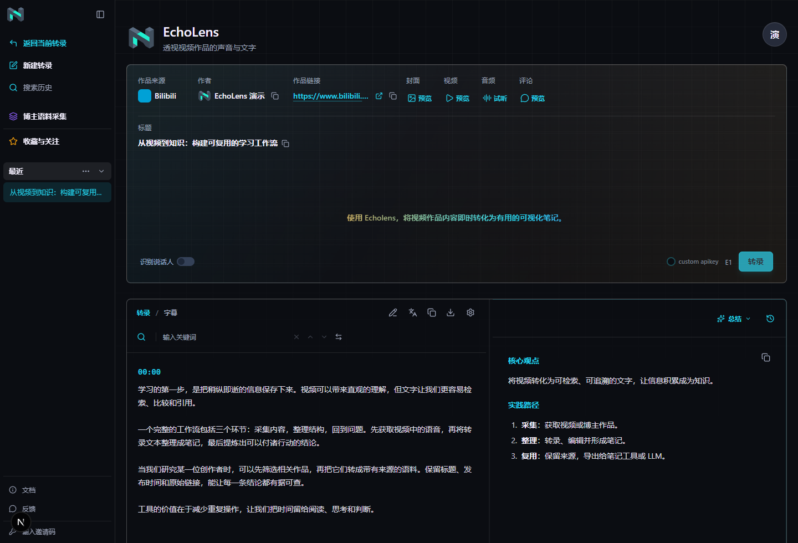
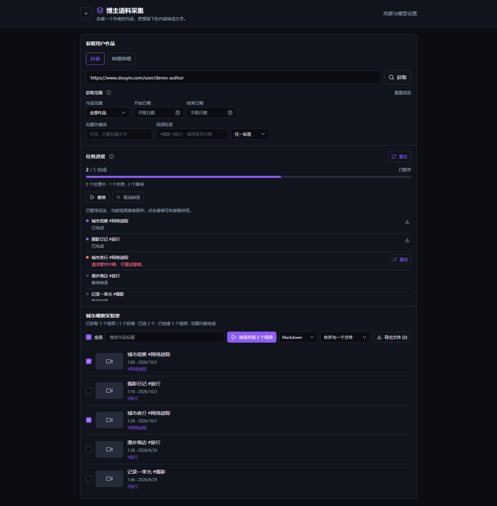
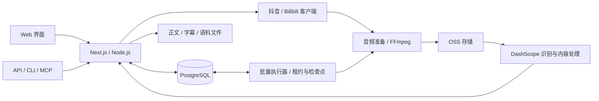

<div align="center">


# EchoLens

**把抖音与 Bilibili 视频，变成可编辑、可检索、可复用的文字与笔记。**

视频解析 · 语音转录 · AI 总结与翻译 · 博主语料采集 · API / CLI / MCP

[](https://github.com/zhanpoint/EchoLens/actions/workflows/deploy.yml)
[](package.json)
[](package.json)
[](LICENSE.md)

[快速开始](#快速开始) · [功能与使用](#功能与使用) · [配置](#配置) · [工具集成](#工具集成) · [参与贡献](CONTRIBUTING.md)



<sub>真实应用界面；截图中的视频、转录和总结为演示数据。</sub>

</div>

## 为什么用 EchoLens

- **少一次反复回看**：粘贴视频链接，提取语音并生成转录；通过时间轴、字幕、搜索和编辑定位有用内容。
- **把内容整理成知识**：在转录基础上生成 AI 总结、翻译，保存历史记录，按需导出正文或字幕。
- **研究一位创作者**：分页获取博主作品，按日期、标题、标签、最新／最早 N 个筛选，再选择作品批量转录。
- **长任务可恢复**：数据库保存队列、执行租约和识别检查点；支持暂停、继续、取消与重试，保留已完成结果。
- **接入现有工作流**：Web、开放 API、CLI 和 MCP 共用媒体与转录链路；为笔记工具、脚本和 AI Agent 提供可追溯文本。

## 快速开始

需要 **Node.js ≥ 22.3、npm、PostgreSQL**。以下命令适用于 **PowerShell 7.6**，使用 Docker 启动本地数据库。已有 PostgreSQL 时直接配置数据库连接即可。

### 1. 下载并安装

```powershell
git clone https://github.com/zhanpoint/EchoLens.git
Set-Location EchoLens
npm ci
```

### 2. 配置服务

仅首次安装执行下面的初始化：生成独立随机密钥，并在本机 `15432` 端口运行持久化数据库。

```powershell
$configText = Get-Content .env.example -Raw
foreach ($name in @('POSTGRES_PASSWORD', 'AUTH_SESSION_SECRET', 'AUTH_EMAIL_CODE_SECRET', 'DATA_ENCRYPTION_KEY')) {
    $secret = [Convert]::ToHexString([Security.Cryptography.RandomNumberGenerator]::GetBytes(32))
    $configText = $configText -replace "(?m)^$name=.*$", ($name + '="' + $secret + '"')
}
$configText = $configText -replace '(?m)^POSTGRES_PORT=.*$', 'POSTGRES_PORT="15432"'
Set-Content .env -Value $configText -Encoding utf8NoBOM
$postgresPassword = [regex]::Match($configText, '(?m)^POSTGRES_PASSWORD="([^"]+)"').Groups[1].Value
docker run --name echolens-dev-db --detach --publish 127.0.0.1:15432:5432 --env POSTGRES_DB=echolens --env "POSTGRES_PASSWORD=$postgresPassword" --mount type=volume,source=echolens-dev-db,target=/var/lib/postgresql/data postgres:17-alpine
```

编辑 `.env`，配置自己的 **SMTP 发信账号**以完成邮箱注册，以及 **DashScope API Key 和 OSS 存储**以使用转录。当前模型接口绑定专用业务空间；自托管需先按下方[模型配置](#模型与平台访问)替换为自己的接口地址。完整变量以 [.env.example](.env.example) 为准。

### 3. 启动并使用

```powershell
npm run dev
```

打开 **[localhost:3000](http://localhost:3000)**，注册并登录。在「设置」配置 API Key 与需要的平台凭据，回到首页勾选使用确认，粘贴视频链接，解析后点击「转录」。数据库表由应用自动迁移。

再次启动已有数据库使用 `docker start echolens-dev-db`。Windows 自动使用已安装的 Edge；其他环境安装浏览器：`npx playwright install chromium`。FFmpeg 由依赖提供，生产镜像使用系统 FFmpeg。

## 功能与使用

| 场景 | 操作与结果 |
| --- | --- |
| 单条视频 | 输入抖音分享链接、Bilibili 链接或 BV 号，解析作品信息，预览或下载可用媒体 |
| 转录与字幕 | 识别语音，查看和编辑正文／字幕；支持说话人标记，导出 Markdown、TXT、JSON、SRT、VTT |
| AI 内容处理 | 对转录内容进行后处理、总结或翻译；可选择与管理总结提示词 |
| 历史与平台内容 | 保存、搜索、重命名和置顶转录历史；通过已授权账号访问收藏与关注、获取一级评论 |
| 博主语料采集 | 获取抖音或 Bilibili 博主的可见作品，筛选、多选、批量转录；导出 Markdown、TXT、JSON |
| 程序与 Agent | 使用 API 访问令牌，通过 HTTP、CLI 或 MCP 解析媒体与转录音频 |

<details>
<summary><strong>博主语料采集：筛选、任务与导出</strong></summary>



1. 输入博主主页链接，点击「获取」。默认遍历全部可见作品，获取中断后可继续分页。
2. 按日期、标题关键词或 `#标签` 筛选；日期包含首尾当天（北京时间），先筛选再取最新／最早 N 个。标签支持任一或全部匹配。
3. 勾选作品并转录，查看任务进度；失败或未完成项可重试。Bilibili 多分 P 作品会转录全部分 P。
4. 导出已完成结果：每个视频一个文件，或合并成一个文件。保留作品标题、来源链接、发布时间与正文，便于 LLM 读取分析。

关闭页面后，持续运行的服务会继续处理。暂停停止领取新项，当前处理可完成；取消终止未完成项，已完成结果仍可导出。服务重启后在租约过期时接管中断项。已提交的服务商任务可能继续执行或计费；提交确认中断时，先核对服务商记录再手动重试。

最新／最早 N 个需要完整扫描后确定排名。分文件导出需要支持目录选择的 Chrome／Edge；其他浏览器可合并导出。截图使用演示数据。

</details>

## 配置

配置从根目录 `.env` 读取，用户级 API Key、平台凭据和偏好在「设置」中管理。

| 配置 | 用途 |
| --- | --- |
| `POSTGRES_*` | 数据库连接、账号和连接池；保存用户、历史、任务与检查点 |
| `AUTH_SESSION_SECRET` / `AUTH_EMAIL_CODE_SECRET` / `DATA_ENCRYPTION_KEY` | 三个独立密钥，至少 32 个字符；加密密钥变更后旧凭据需重新保存 |
| `SMTP_USER` / `SMTP_PASSWORD` | 注册、验证码登录和找回密码所需的发信账号 |
| `DASHSCOPE_API_KEY` / `ALI_OSS_*` | 模型服务与音频存储；用户可使用自己的 API Key |
| `DOUYIN_ACCOUNT_SERVICES_ENABLED` / `BATCH_TRANSCRIBE_CONCURRENCY` | 抖音账号服务开关；批量并发默认 `2`，每个 Node 进程范围 `1–8` |

<details>
<summary><strong>邮件、OSS 与浏览器设置</strong></summary>

- SMTP 默认 `smtpdm.aliyun.com:465`、SSL 开启。根据发信服务商添加 `SMTP_HOST`、`SMTP_PORT`、`SMTP_USE_SSL`、`SMTP_USE_TLS`、`SMTP_FROM`；默认发件人为 `SMTP_USER`。示例发信地址需要替换。
- OSS 配置 `ALI_OSS_REGION`、`ALI_OSS_ENDPOINT`、`ALI_OSS_BUCKET`、`ALI_OSS_ACCESS_KEY_ID`、`ALI_OSS_ACCESS_KEY_SECRET`。私有音频 Bucket 需写入权限和有效签名 URL，无需公共读；签名有效期默认 86400 秒。
- 开放 API 的公共媒体使用 `ALI_OSS_PUBLIC_BUCKET`；为对应公共路径配置读取权限及生命周期删除规则。
- 自定义抖音浏览器路径使用 `DOUYIN_BROWSER_EXECUTABLE`。

</details>

### 模型与平台访问

当前 DashScope 接口地址位于 [fixed-config.ts](src/lib/dashscope/fixed-config.ts)，使用新加坡地域的专用业务空间。**自托管需将两个地址替换为自己控制台提供的原生和兼容接口地址**，再启动或构建；Key 的地域、业务空间和模型授权必须匹配。

| 用途 | 当前默认模型 |
| --- | --- |
| 语音识别 E1 | 音频 ≤ 300 秒使用 `qwen-audio-3.1-asr-flash`；长音频或未知时长使用 `qwen-audio-3.1-asr-flash-filetrans` |
| 转录后处理 / AI 总结 | `deepseek-v4.1-flash` |
| 翻译 | `qwen-mt-flash` |

模型变量见 `.env.example`；调用能力、地域和费用以服务商控制台与[官方识别文档](https://docs.modelstudio.console.alibabacloud.com/zh/model-studio/non-realtime-speech-recognition-user-guide)为准。

抖音账号功能需要站点开关、账号权限和有效的平台访问凭据；权限可通过现有邀请／管理员流程授予。Bilibili 在需要时使用登录凭据。可获取范围取决于账号与平台，私密、删除、地区限制和风控可能影响结果。

## 工具集成

在「设置 → API 访问令牌」创建令牌。开放 API 使用 `Authorization: Bearer <token>`，与浏览器会话认证分离。完整接口和工具说明在运行中的 **[应用文档 `/docs`](http://localhost:3000/docs)**。

| 入口 | 能力 |
| --- | --- |
| `POST /api/open/media/resolve` | 解析 1–10 个媒体输入，返回作品信息与可用媒体地址 |
| `POST /api/open/transcripts/transcribe` | 转录指定视频；识别模型统一使用 `e1` |
| [CLI](packages/echolens-cli/bin/echolens.mjs) | `media resolve`、`transcript transcribe` |
| [MCP](packages/echolens-mcp/bin/echolens-mcp.mjs) | `echolens_resolve_media`、`echolens_transcribe`，通过 stdio 接入 Agent |

<details>
<summary><strong>可复制的 PowerShell API、CLI 与 MCP 示例</strong></summary>

在项目根目录执行，输入自己的令牌与视频链接。下面的调用解析媒体，不提交语音识别。

```powershell
$env:ECHOLENS_BASE_URL = 'http://localhost:3000'
$env:ECHOLENS_API_TOKEN = Read-Host '输入设置页生成的 API 访问令牌' -MaskInput
$videoUrl = Read-Host '输入抖音或 Bilibili 视频链接'
Invoke-RestMethod -Method Post -Uri "$env:ECHOLENS_BASE_URL/api/open/media/resolve" -Headers @{ Authorization = "Bearer $env:ECHOLENS_API_TOKEN" } -ContentType 'application/json' -Body (@{ inputs = @($videoUrl) } | ConvertTo-Json)
node packages/echolens-cli/bin/echolens.mjs media resolve --input $videoUrl --json
```

生成本地 MCP 配置，复制到支持 MCP 的客户端；其中令牌仅供本机配置使用：

```powershell
@{
    mcpServers = @{
        echolens = @{
            command = 'node'
            args = @((Resolve-Path packages/echolens-mcp/bin/echolens-mcp.mjs).Path)
            env = @{
                ECHOLENS_BASE_URL = $env:ECHOLENS_BASE_URL
                ECHOLENS_API_TOKEN = $env:ECHOLENS_API_TOKEN
            }
        }
    }
} | ConvertTo-Json -Depth 6
```

</details>

## 架构与部署



平台客户端、媒体准备、模型调用与存储分层复用；数据库租约协调任务领取，检查点保留已完成视频、分 P 和已确认的识别任务。用户结果与凭据按账号隔离。

生产环境使用持续运行的 Node 服务，配置数据库持久化、备份及代理长请求超时。构建并启动：

```powershell
npm ci
npm run build
npm run start
```

容器部署入口为 [Dockerfile](Dockerfile) 和 [deploy/compose.yml](deploy/compose.yml)，需配置 `ECHOLENS_IMAGE` 与服务器环境文件。批量任务依赖后台执行器，不能部署到仅在请求期间存活的 Serverless 环境。

## 常见问题

| 问题 | 处理方式 |
| --- | --- |
| 注册收不到验证码 | 检查 SMTP 发信账号、授权密码、SSL／TLS、端口与发信地址 |
| 转录提示配置或授权错误 | 检查业务空间接口、API Key、模型权限与 OSS 签名可访问性 |
| 抖音获取被拒绝 | 检查站点开关、账号权限和已验证凭据；平台风控时稍后继续，避免密集重试 |
| 筛选提示需要重新获取 | 当前缓存尚未覆盖所需范围，按页面提示继续获取并应用筛选 |
| 服务重启后任务未立即继续 | 等待未完成项租约过期；额度、凭据或限流导致暂停时修正配置后继续／重试 |

## 参与贡献与许可

欢迎通过 [Issues](https://github.com/zhanpoint/EchoLens/issues) 报告问题或讨论需求，通过 Pull Request 提交改进。开发流程和数据库测试见 [CONTRIBUTING.md](CONTRIBUTING.md)。提交前执行：

```powershell
npm run typecheck
npm run lint
npm test
npm run build
```

本项目公开源代码，采用 **[PolyForm Noncommercial 1.0.0](LICENSE.md)**，允许协议范围内的非商业使用、研究和修改，**不授权商业用途**。这是非商业源码许可，不是 OSI 认可的开源许可证；第三方依赖遵循各自协议。

感谢 Next.js、React、PostgreSQL、Playwright，以及 [douyin-downloader](https://github.com/jiji262/douyin-downloader) 和 [Bili23-Downloader](https://github.com/ScottSloan/Bili23-Downloader) 的技术与工程参考。

Required Notice: Copyright 2026 zhanpoint.
